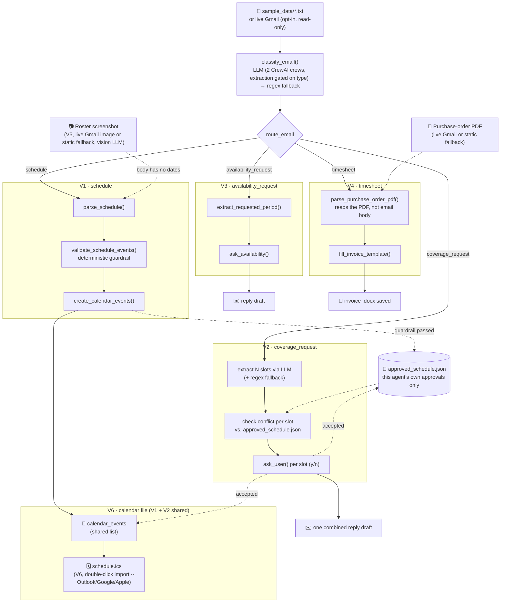

# Scheduler Agents


CrewAI-based portfolio project for automating interpreter schedule workflows.

## Demo

V1 (schedule): classify -> extract -> deterministic guardrail -> calendar
events -> `schedule.ics` saved, ready to double-click into a real calendar
app.

https://github.com/user-attachments/assets/77bf3bc5-b211-48c4-8c02-c501160e6652

V2 (coverage_request): the human-in-the-loop step -- the agent checks the
offered slot against the local approved-schedule store, states the
conflict result explicitly, then asks a real y/n question in the
terminal before drafting anything, and ends with `schedule.ics` actually
opening in Outlook.

https://github.com/user-attachments/assets/e02c819c-499c-4482-abf2-e67116dea696

V5 (roster screenshot): no parseable text in the email body at all -- a
vision-capable LLM reads the actual roster image directly and extracts
structured events + the roster's own timezone label, still checked by
the same deterministic guardrail before anything reaches a calendar.

https://github.com/user-attachments/assets/d009ac00-33d4-4e4e-85a2-cabc69464233

## Architecture

A shared spine (receive email -> classify -> route) fans out into four
independent workflows. Every workflow ends in a draft or a locally-saved
file, never an automatic send, and every LLM extraction is checked by a
deterministic guardrail before anything reaches a calendar.



## Milestones

V1 focuses on the safest useful path:

```text
sample email -> classify email -> parse schedule -> validate events -> calendar-ready events
```

`classify_email` had a real false-positive, found via three separate real
vendor emails, all mentioning a date/time but none being an actual
schedule: a complaint about a late login for a *past* shift (worse, the LLM
extracted that referenced past time as a new calendar event); a Criminal
Background Check renewal *deadline* notice (the offline regex fallback got
this one right, since neither "schedule" nor "roster" appears in it -- only
the live LLM crew got it wrong); and a scheduler's reply confirming a shift
was *removed* from the roster after the interpreter reported an emergency
(the LLM extracted the removed shift as a brand-new event titled "Shift
removed" -- this system also has no delete/cancel workflow, so there was
nothing correct to do with it either way). Fixed by adding explicit
negative examples to the `classify_email` task prompt
(`crews/schedule_crew/config/classify_tasks.yaml`): a date/time appearing in the
body isn't itself evidence of "schedule" -- past-shift attendance feedback,
compliance/document deadlines, and shift-removal confirmations are all
`other`. Re-verified live against all three real emails afterward: all
classify as `other` with zero events extracted.

A fourth one, from a real reply thread, turned out worse: after a
"cancelled your shift" confirmation (which already correctly classified as
`other`), a follow-up reply reinstating that same shift -- "Okay, I will
assign you your originally scheduled shift back. Thank you." -- has no
date/time in it at all, misclassified as `schedule`, and because
`extract_schedule` found nothing in the body, `parse_schedule` fell through
to the roster-image vision path and pulled in **five unrelated events from
the static demo roster image** (`sample_data/sample_roster.png`, the
default `--roster-image` fallback). A classification miss on a body with no
parseable dates is more dangerous here than one with a wrong date, since it
can silently substitute an entirely unrelated image's data. Fixed with a
fourth negative example plus a tightened "schedule" definition (a short
reply-thread status update on one already-known shift is not a proactive
roster announcement, even when the wording sounds similar to one). Re-
verified live, twice, against the real reply: `other` both times, zero
events, no vision fallback triggered.

V2 adds the coverage-request workflow. A real coverage email can offer
*several* distinct slots at once -- specific dates, combined date/time
listings ("April 9: 10am-12pm and 1-2pm" is two slots), and sometimes a
vague, non-dated appeal alongside them ("we need help Mon-Wed 11am-1pm this
month"). Extraction tries an LLM first (handles 12-hour times, multiple
dates, split listings, relative phrases like "today" or "next Monday", and
keeps the vague appeal as a separate `coverage_unstructured_note` rather than
inventing dates for it), falling back to a single-slot regex parser if no LLM
is configured or it fails. Relative phrases are resolved against
`EmailInput.sent_date` (parsed from a `Date:` header when the source has one,
otherwise today) via a deterministic lookup table built in Python and handed
to the LLM -- the model looks the date up instead of computing it, which
keeps off-by-one weekday/week errors out of the one place plain code can
just get right.

Some real vendor emails list bare weekday names instead of dates entirely
(e.g. "Monday: 11am-3pm" under a "first week of March" heading). Asking the
LLM to turn that directly into a date is unreliable -- tested against a real
example, it assigned March 1-7 in list order without checking that March 1
actually falls on a Sunday, shifting every weekday's hours onto the wrong
date. So the model is only asked to extract `{weekday, start_time,
end_time}` pairs plus the period phrase verbatim; `resolve_period_phrase()`
resolves the phrase to a concrete week in Python (`calendar`-module date
arithmetic, no LLM involved), and each weekday is then placed within that
week directly. A period phrase that doesn't parse (or is missing) leaves
those slots out of the calendar entirely and surfaces a count in
`coverage_unstructured_note` instead of guessing. Tested against another
real vendor email mixing weekday-name-plus-day-of-month slots ("today
Thursday, 5th", "Friday, 6th", "Saturday, 7th" -- correctly resolved) with
genuinely unbounded recurring ones ("Saturdays: 2-4pm", no period at all --
correctly left out and flagged, not guessed).

Each extracted slot is checked against the local approved-schedule store for
conflicts (context only, see "Approved Schedule Store" below) and then the
human is asked directly -- "Can you cover this shift? (y/n)" -- one slot at a
time. The CLI prompt states the conflict result explicitly either way
("Conflict: yes/no"), not just as a warning when there happens to be one, so
silence is never ambiguous with "conflict wasn't even checked"; the check
itself never decides for them. Accepting a slot commits it
immediately (not just for future emails): if the same request offers two
overlapping slots, accepting the first makes the second show up as a
conflict too. One combined reply is drafted covering every slot; accepted
slots are added to `calendar_events` and the approved-schedule store. The
reply is always a draft -- nothing is ever sent automatically.

```text
coverage email -> extract N slots (+ optional vague note) -> check each conflict -> ask human per slot (y/n) -> one combined draft + calendar updates for accepted slots
```

This step is deliberately a plain terminal prompt rather than a notification
service (Telegram, email, etc.): a real async notification/response loop is
a legitimate future upgrade, but it's a separate infrastructure concern from
"the agent asks before deciding," and adding it now would be solving a
problem this project doesn't have yet.

V3 adds the availability-request workflow: the scheduler asks for the
interpreter's availability for a period (e.g. "your June availability"),
so unlike V1/V2 there's nothing to extract a decision from -- the flow
figures out which period is being asked about, asks the human to state
their availability for it, and drafts the reply. Same rules as V2: always a
draft, human approves and sends it.

```text
availability email -> extract period -> ask human for availability -> draft reply (never sent)
```

V4 adds the timesheet/invoice workflow. Here the vendor's monthly
notification email body carries no usable data at all ("please find
attached the Purchase Order...") -- job id, period, and amount all live in
the attached PDF, so this is the one workflow that reads a PDF directly
instead of `email.body`. Extraction tries a regex parser first (matches
this vendor's usual layout) -- `extract_purchase_order_via_llm`
(`timesheet_tool.py`) is a single-shot `litellm.completion()` fallback for
a purchase order that doesn't (a different job-id format, unusual "Total"
line wording), the same single-shot "read this as JSON" pattern as
coverage/roster extraction, not a CrewAI crew, since there's no multi-step
reasoning here. It fills only the known monthly-varying cells in a fixed
Word invoice template (invoice number, date, job id, amount/total) and
saves a new `.docx` locally -- it never uploads or submits anything to the
vendor platform; the human reviews and submits it themselves. Every static
field (name, address, bank details, bill-to) is left untouched.

When live Gmail is enabled, `receive_email()` downloads the actual PDF
attachment off the fetched message (`gmail_tool.py`'s `messages().list()`/
`get()`/`attachments().get()` -- the same `gmail.readonly` scope already
covers attachment bytes, no extra permission needed) to
`outputs/downloaded_purchase_order.pdf`, and `handle_timesheet()` prefers
that over the static `sample_data/sample_purchase_order.pdf` fallback. A
run that finds no PDF leaves `live_pdf_attachment_path` unset rather than
checking whether a file happens to exist on disk, so a stale download from
a previous run is never silently reused.

```text
purchase-order PDF -> extract job id/period/amount -> fill invoice template -> save .docx (never submitted)
```

V5 adds roster-screenshot extraction for V1. Real monthly rosters from this
vendor arrive as a *screenshot* of a spreadsheet -- a grid of dates x hourly
slots -- with zero parseable text in the email body, and no text layer for
regex or the text-only CrewAI agents to read. `parse_schedule` tries, in
order: LLM (already done in `classify_email` if it found anything) -> regex
over `email.body` -> a vision-capable LLM call over the roster image. This is
a plain `litellm.completion()` call, not a CrewAI agent, since it's one
single-shot "describe this image as JSON" call rather than multi-step
reasoning. A roster screenshot has no parseable text, so there's no regex
fallback possible here the way every other extraction path has one --
instead, `parse_roster_image` tries each of several curated
known-vision-capable models in priority order (Groq's `qwen/qwen3.6-27b`,
then `gpt-4o-mini`, then Gemini's `gemini-3.6-flash` -- Google retired
`gemini-2.0-flash` since this was first written; see below) until one succeeds,
skipping straight to the next configured candidate on failure. This is
deliberately not the same `MODEL` env var every other LLM call in this
project follows -- `MODEL` is usually chosen for classification/coverage
text tasks and isn't necessarily vision-capable. It also reads the roster's
own timezone label (e.g. "UK") from the
column headers, since that can differ from the interpreter's own default
timezone. As with every other LLM path in this project, the deterministic
guardrail (`validate_schedule_events`) always re-runs over whatever it
extracts. Real rosters have no language column at all -- this vendor
relationship is Persian interpretation only, a known fact about the
interpreter's employment, not per-email data -- so `validate_schedule` (V1)
and `handle_coverage_request` (V2) assign `UserMemory.default_language` to
every event/slot unconditionally rather than treating it as something to
extract or validate; `validate_schedule_events` has no language check at
all as a result.

```text
roster screenshot -> vision LLM -> events + timezone label -> deterministic guardrail -> calendar (or blocked + approval)
```

**Live Gmail image ingestion added later, with two real bugs found the same way every other bug in this project was found -- live testing.** `gmail_tool.py` originally only downloaded PDF attachments (V4); a real `schedule` email with the actual roster as an *embedded image* always silently fell through to the static demo fixture instead, producing the wrong month's data. Fixed by downloading the message's embedded image the same way, with two rounds of live verification:

1. First attempt picked the *largest* embedded image (reasoning: a signature logo would be small). **Verified wrong against a real email**: the vendor's signature includes a photographic marketing banner that outweighs the actual roster screenshot (flat colors, far more compressible) by roughly 6x. Fixed to pick the *first* embedded image in MIME document order instead -- confirmed against the real message that the mail client (Outlook) places the body-referenced image before signature-block images every time.
2. Separately, the real roster (42 events for a full month) was silently truncated mid-JSON by a missing `max_tokens` cap on the vision call -- invisible against every roster fixture already in this repo, since none has more than 5 events. Fixed with an explicit `max_tokens=8000` and a per-provider rate-limit retry (Groq's free tier is a flat 8000 tokens/minute, shared across every Groq call this project makes). Re-verified live: 42/42 events extracted correctly.

The same rate-limit retry gap existed in the live flow's own `classify_email`/extraction path (`scheduler_flow.py`) -- `evals/run_eval.py` already retried Groq's rate limit, but the actual production flow didn't, so a real live run hit the limit and silently fell back to regex instead of retrying. Fixed with the identical retry pattern (4 attempts, 20s apart) in both places.

Separately, a fresh `GEMINI_API_KEY` surfaced a real, non-obvious litellm behavior: relying on litellm's automatic env-var pickup for this key routed through a different internal auth path (a Vertex-AI-style endpoint expecting an OAuth token) and failed with a 401, while the *same* key passed as an explicit `api_key` parameter worked immediately. Fixed by always passing `api_key` explicitly per provider. Gemini's own API can still be intermittently flaky post-fix (401/503 alternating on identical requests, likely rollout instability on the newer `gemini-3.6-flash` model) -- Groq remains the reliable primary provider; Gemini is a bonus fallback.

V6 adds a real, usable calendar output. Every workflow before this ended in
either a draft reply (V2/V3, already human-readable) or a raw
Google-Calendar-API-shaped JSON blob (`calendar_payloads.json`) that a
human can't actually do anything with directly. [`ics_tool.py`](src/scheduler_agents/tools/ics_tool.py)
turns whatever ended up in `SchedulerFlowState.calendar_events` -- V1's
approved monthly schedule or V2's accepted coverage slots, whichever
workflow actually ran, since both already write into that same shared
list -- into `outputs/schedule.ics`, a standard iCalendar file that opens
directly in Outlook, Google Calendar, or Apple Calendar with a
double-click. Built with the `icalendar` library rather than hand-rolled
ICS text, since the format has real interop gotchas (line folding at 75
octets, mandatory CRLF line endings, TEXT-field escaping, VTIMEZONE
blocks) that are easy to get subtly wrong. Still zero real calendar
integration -- no API, no OAuth, nothing sent anywhere -- same rule as
every other output in this project.

```text
calendar_events (V1 or V2) -> build_ics_calendar() -> outputs/schedule.ics (double-click import, never auto-connected to a real calendar)
```

Two real bugs surfaced by actually opening the generated file, not by
inspecting it as text:

1. The first version omitted `UID` and `DTSTAMP` on every event -- both
   REQUIRED by RFC 5545. Google/Apple Calendar tolerated the omission;
   Outlook, the client this feature was specifically built for, is
   historically stricter about it. Fixed by adding both -- `UID` is a
   deterministic hash of the event's own content (date/time/summary)
   rather than a random `uuid4`, so regenerating this file from the same
   source data twice produces the same `UID` and reimporting updates
   rather than duplicates.
2. The user opened the file in her real Outlook and every event showed an
   hour earlier than the file's own `DTSTART`. Root cause: `icalendar`'s
   `Calendar.add_missing_timezones()` scans the full 1970-2038 tzdata
   range by default, which pulled Armenia's real but long-obsolete
   pre-2012 DST rules for `Asia/Yerevan` (a fixed +04:00 with no DST
   since) into the VTIMEZONE block -- Outlook applied that stale rule
   anyway and shifted every event. Fixed at the root, not with a
   Yerevan-specific special case: narrowed the scanned date range to
   roughly the window this file's events could plausibly fall in (1 year
   back, 2 years forward) via `icalendar.Timezone.from_tzid`'s
   `first_date`/`last_date` params. A zone with no DST currently in effect
   now resolves to one simple fixed-offset rule instead of a stale
   historical table, while a zone that genuinely still observes DST
   (`Europe/London`, used for roster events) still gets a correct
   STANDARD/DAYLIGHT pair -- verified both directly, then re-verified by
   the user re-opening the fixed file in her actual Outlook.

The project is intentionally designed with:

- CrewAI Flow orchestration
- Role-based agents
- Deterministic tools
- Pydantic state models
- Guardrails and validation
- Async execution path
- Hook-style event logging
- Simple local memory
- Human approval points for risky actions

## Project Structure

```text
scheduler-agents/
├── pyproject.toml
├── .env.example
├── README.md
├── outputs/            (generated at runtime; calendar_payloads.json,
│                        flow_state.json, schedule.ics are committed as
│                        demo artifacts, approved_schedule.json and any
│                        live-downloaded PDF/image are gitignored -- may
│                        contain real personal data)
├── evals/
│   └── run_eval.py
├── sample_data/
│   ├── sample_schedule_email.txt
│   ├── sample_coverage_request_email.txt
│   ├── sample_coverage_request_relative_dates_email.txt
│   ├── sample_coverage_request_weekly_availability_email.txt
│   ├── sample_coverage_request_mixed_dates_email.txt
│   ├── sample_availability_request_email.txt
│   ├── sample_purchase_order_email.txt
│   ├── sample_purchase_order.pdf
│   ├── sample_roster_email.txt
│   ├── sample_roster.png
│   ├── sample_roster_full_month.png
│   ├── sample_approved_schedule.json
│   ├── sample_other_attendance_complaint_email.txt
│   ├── sample_other_compliance_deadline_email.txt
│   ├── sample_other_shift_removal_confirmation_email.txt
│   ├── sample_other_shift_reinstated_confirmation_email.txt
│   ├── sample_other_reaction_notification_email.txt
│   └── invoice_template.docx
├── src/
│   └── scheduler_agents/
│       ├── main.py
│       ├── output_writer.py
│       ├── crews/
│       │   └── schedule_crew/
│       │       ├── crew.py
│       │       ├── config/
│       │       │   ├── classify_agents.yaml
│       │       │   ├── classify_tasks.yaml
│       │       │   ├── extraction_agents.yaml
│       │       │   └── extraction_tasks.yaml
│       │       └── guardrails/
│       │           └── guardrails.py
│       ├── flows/
│       │   └── scheduler_flow.py
│       ├── guardrails/
│       │   └── schedule_guardrails.py
│       ├── hooks/
│       │   └── event_hooks.py
│       ├── memory/
│       │   └── user_memory.py
│       ├── models/
│       │   └── state.py
│       └── tools/
│           ├── availability_tool.py
│           ├── calendar_tool.py
│           ├── coverage_tool.py
│           ├── gmail_tool.py
│           ├── ics_tool.py
│           ├── invoice_tool.py
│           ├── llm_json.py
│           ├── roster_vision_tool.py
│           ├── schedule_parser_tool.py
│           ├── schedule_store.py
│           └── timesheet_tool.py
└── tests/
    ├── conftest.py
    ├── test_scheduler_flow_units.py
    ├── test_coverage_workflow.py
    ├── test_availability_workflow.py
    ├── test_timesheet_workflow.py
    ├── test_roster_vision_workflow.py
    ├── test_gmail_workflow.py
    ├── test_ics_tool.py
    ├── test_schedule_store.py
    └── test_llm_json.py
```

## Two run modes

The flow works with **zero setup and zero cost**: if no `MODEL`/API key is
configured, `classify_email` and `parse_schedule` fall back to a deterministic
regex path, so tests, CI, and demos never need an API key.

Set `MODEL` and a matching API key in `.env` to switch on the real CrewAI
agents (`inbox_intelligence_agent`, `schedule_parser_agent`,
`schedule_validator_agent` from `crews/schedule_crew/`) for classification and
extraction. See `.env.example` for free options (Google Gemini, Groq) and
paid ones (OpenAI). If the LLM call fails for any reason (bad key, rate
limit, network), the flow logs it as a hook event and falls back to the
regex path rather than crashing.

Either way, the final schedule-validation guardrail is always the
deterministic one (`guardrails/schedule_guardrails.py`) — the LLM is trusted
to extract data, never to decide on its own that data is safe to write to a
calendar.

Not every LLM call in this project goes through CrewAI crews: those are
specifically for schedule classification/extraction, where multi-step
agent handoffs (classify -> extract -> validate) are the point. Even there,
it's two crews, not one -- `ClassifyEmailCrew` (`inbox_intelligence_agent`)
always runs first; `ScheduleExtractionCrew`
(`schedule_parser_agent` + `schedule_validator_agent`) only kicks off when
classification actually comes back `schedule`, instead of every email
paying for extraction/validation LLM calls whose output would just be
discarded. Coverage-slot extraction (V2) and roster-image extraction (V5)
are each one single-shot "read this as JSON" call via `litellm.completion()`
-- coverage follows whatever `MODEL` is configured, same as the crews;
roster vision instead tries its own curated list of known-vision-capable
models (see "Milestones" above), since `MODEL` isn't necessarily
vision-capable. A CrewAI Task/Crew would add ceremony without adding
anything for either of those.

This project is pinned to Python 3.12 via `.python-version` (crewai's
dependency chain lags behind the newest CPython releases).

## Approved Schedule Store

V2's conflict check deliberately does *not* talk to a real calendar.
[`schedule_store.py`](src/scheduler_agents/tools/schedule_store.py) reads
and writes a local `outputs/approved_schedule.json` -- a flat list of
`ScheduleEvent`s -- which is this agent's *only* source of truth for "is
this coverage slot already committed":

- V1 (`create_calendar_events`) appends a month's schedule to it once that
  schedule clears the deterministic guardrail -- the same "approved" bar V1
  already applies before building calendar payloads at all.
- V2 (`handle_coverage_request`) reads it for the conflict check, and
  appends any slot the human accepts, immediately -- so a second overlapping
  slot offered in the *same* email is flagged against the one just
  accepted, not just against future emails.
- Re-saving an identical date/start/end (e.g. re-running the same month) is
  deduped rather than appended twice.

A real personal calendar (Google/Outlook) mixes in dentist appointments,
school pickups, and everything else that has nothing to do with work
scheduling -- pointing V2's conflict check at one would flag all of that as
"conflicts" a work-coverage agent has no reason to know about, and would
require OAuth/credentials/scopes for a signal that's actually less accurate
than what this agent already knows about itself. The approved schedule this
agent built and got a human to sign off on **is** the correct source of
truth for this specific question.

The store is a flat JSON file for now (`json.dumps`/`json.loads`,
`sample_data/sample_approved_schedule.json` auto-seeds it on first run) --
plenty for this project's scale. If this ever needs concurrent writers or
queries across many months, that's a SQLite migration (`approved_schedules`
+ `schedule_slots` tables), not a redesign -- `schedule_store.py` is the one
place that would change.

## Live Gmail Ingestion (optional)

Same zero-setup default as everything else: `GMAIL_ENABLED` unset/false (the
default) means `receive_email` reads `sample_data/*.txt` -- no Google
account needed for tests, CI, or a demo run.

Set `GMAIL_ENABLED=true` plus a Google OAuth `credentials.json` (see
`.env.example` for the exact setup steps) to switch on
[`gmail_tool.py`](src/scheduler_agents/tools/gmail_tool.py): each run
fetches the single most recent message matching `GMAIL_QUERY` via
`messages().list()`/`.get()`, decodes its MIME body (walks multipart
messages for the first `text/plain` part), and uses its real `Date` header
as `EmailInput.sent_date` -- the same field V2's relative-date resolution
already anchors to, so "today"/"next Monday" in a real inbox message
resolve correctly without any extra wiring.

`GMAIL_QUERY` defaults to `from:(glocco.com OR glocco.sk) is:unread` even
with the env var unset -- this project automates one real vendor
relationship, not a generic inbox scanner, so scoping to it is the built-in
behavior, not something that needs configuring. Both real sending domains
are covered: `glocco.com` for scheduling/coverage mail, `glocco.sk` for
Purchase Order/invoicing notifications (confirmed live -- a
`glocco.com`-only query silently missed a real unread Purchase Order email
from `glocco.sk` until this was caught and fixed). Override the env var
only if you need something narrower/different.

The OAuth scope is deliberately the narrowest one that exists for this --
`gmail.readonly`. This integration calls `list`/`get` only: it never marks a
message read, labels it, archives it, sends anything, or deletes anything.
A human decides what happens to the source email in their own inbox; this
agent only ever reads it. The one-time consent runs in your own browser on
first live run and caches a refresh token to `token.json` (gitignored) so
it doesn't prompt again. A live fetch failure (expired token, network, or
simply nothing matching the query) is logged as a hook event and falls back
to the sample-file path rather than crashing, same as every other external
call in this project.

## Run

```bash
uv sync
uv run python -m scheduler_agents.main
```

Run the coverage-request path instead:

```bash
uv run python -m scheduler_agents.main --sample sample_coverage_request_email.txt
```

Run the availability-request path (it will prompt you in the terminal for
your availability):

```bash
uv run python -m scheduler_agents.main --sample sample_availability_request_email.txt
```

Run the timesheet/invoice path (fills `sample_data/invoice_template.docx`
from `sample_data/sample_purchase_order.pdf` and saves the result to
`outputs/`):

```bash
uv run python -m scheduler_agents.main --sample sample_purchase_order_email.txt
```

Run the schedule path against a roster screenshot instead of the plain-text
sample (falls back to vision extraction since the email body has no
parseable dates; requires `GROQ_API_KEY`):

```bash
uv run python -m scheduler_agents.main --sample sample_roster_email.txt --roster-image sample_data/sample_roster.png
```

For a quick run without installing the package first:

```powershell
$env:PYTHONPATH="src"
python -m scheduler_agents.main
```

The run writes:

```text
outputs/calendar_payloads.json
outputs/flow_state.json
outputs/schedule.ics
```

`schedule.ics` is a standard iCalendar file built from whatever ended up in
`calendar_events` -- V1's approved monthly schedule or V2's accepted
coverage slots, whichever workflow actually ran (both already write into
the same list). It opens directly in Outlook, Google Calendar, or Apple
Calendar with a double-click and imports the events, with zero connection
to a real calendar account or API -- same "local file only, human decides
what happens to it" rule as every other output in this project.

## Test

```bash
uv run pytest
```

`uv run` auto-loads `.env`, so without `tests/conftest.py` a configured
MODEL/API key would silently leak into the test run. `conftest.py` strips
those env vars for every test, so the suite always exercises the
deterministic path — fast, offline, free, and not dependent on a third-party
API being up.

## Evals

`pytest` is deliberately LLM-free (see above); the LLM path is checked
separately with a live evaluation script, `evals/run_eval.py`, that needs a
real `MODEL`/API key:

```bash
uv run python evals/run_eval.py
```

It classifies (and, for the `schedule` cases, extracts) 13 real/realistic
sample emails and asserts each against a known-correct expected result: the
right `email_type` label, and for the five real vendor false-positives
`classify_email`'s prompt was hardened against this session (a complaint
about a past shift, a compliance deadline, a shift-removal confirmation,
a shift-reinstatement confirmation, a "reacted to your message" notification
on an already-answered thread), that zero events get extracted -- not
just the right label, but no side effect either. Retries on
`litellm.RateLimitError` with a fixed backoff, since Groq's free tier caps
at 8000 tokens/minute and running every case back-to-back reliably exceeds
it partway through.

A separate vision case (`roster_full_month_no_truncation`) calls
`parse_roster_image` directly against a synthetic 46-event roster
screenshot (`sample_data/sample_roster_full_month.png`) instead of going
through `run_llm_pipeline` -- this guards a real, independent bug found
live this session: a missing `max_tokens` cap silently truncated a real
42-event roster's JSON mid-array, and every roster fixture already in this
repo has only 5 events, too small to ever have caught it.

This isn't a formality: on its first real run, it immediately caught the
item-6 regression described above (`ClassifyEmailCrew` crashing with
`KeyError` on every call, silently masked by the regex fallback) --
exactly the kind of bug that "verify live once, manually, with a sample
that happens to work either way" doesn't catch, but a repeatable eval
suite does. Fixing it also surfaced a second issue only visible once the
LLM extraction path actually ran for the first time all session: the model
returned an empty `title` for every schedule event (silently blanking real
calendar event summaries), fixed by no longer asking the extraction task
for `language`/`title`/`source` at all -- those are fixed, known facts for
this one vendor relationship, not per-email data -- plus a defensive
backfill in `validate_schedule` in case a model sends one anyway.

## Next Steps

1. ~~Replace the sample email input with real ingestion~~ -- done for
   Gmail (see "Live Gmail Ingestion" above); Outlook would need its own
   tool module following the same `is_live_*_enabled()` / fallback pattern
   as `gmail_tool.py` and `schedule_store.py`.
2. ~~Connect V2's conflict check to a real calendar~~ -- deliberately not
   done, and not planned: see "Approved Schedule Store" above for why a
   local store of this agent's own approvals is a better source of truth
   than a real Google/Outlook calendar for this specific question, and
   removes the OAuth/credentials surface entirely.
3. Move the coverage-request y/n prompt off the terminal onto an actual
   notification channel (e.g. Telegram) so it doesn't require the flow to be
   running interactively -- this needs an async "ask now, resume later"
   design (persisted pending-decision state, polling/webhook for the
   response), not just swapping `input()` for an API call.
4. ~~Coverage-slot extraction still can't resolve *relative* dates~~ --
   done: relative phrases ("today", "tomorrow", "next Monday") now resolve
   via a deterministic lookup table anchored to `EmailInput.sent_date` (a
   parsed `Date:` header, falling back to today). Try it with:

   ```bash
   uv run python -m scheduler_agents.main --sample sample_coverage_request_relative_dates_email.txt
   ```

   (requires `MODEL`/an API key -- the regex fallback still only handles the
   strict explicit-date format, by design.)
5. ~~Add CrewAI eval cases for classification, parsing, and safe tool use~~
   -- done: see "Evals" below. Immediately caught a real, previously
   undetected regression from item 6, on its very first run.
6. ~~Split classification from extraction~~ -- done: `crew.py` now has two
   crews, `ClassifyEmailCrew` (runs on every email) and
   `ScheduleExtractionCrew` (`extract_schedule` + `validate_schedule`,
   kicked off only when classification actually comes back `schedule`).
   `run_llm_pipeline()` orchestrates the two-step decision in plain Python
   -- the same "let deterministic code branch, don't pay an LLM to decide
   something already knowable" principle `route_email()`'s `@router`
   already uses, considered and rejected the CrewAI Hierarchical process
   for this exact reason (a manager-agent LLM call to make a decision a
   plain `if` already makes correctly).

   **This split shipped broken and stayed that way for three more commits**
   (items 7-9 below) before the eval suite (item 5) caught it: crewai's
   `CrewBase` resolves every task entry in a shared `tasks.yaml` against
   the *current* class's own agents regardless of which tasks are actually
   decorated in that class, so `ClassifyEmailCrew` crashed with
   `KeyError: 'schedule_parser_agent'` on literally every call --
   `scheduler_flow.py`'s except-and-fall-back-to-regex handler caught it
   silently every time, and regex happened to classify every sample email
   used for "live verification" the same way the LLM would have, so
   nothing looked wrong from the outside. Fixed by giving each crew its
   own config files (`classify_agents.yaml`/`classify_tasks.yaml` vs.
   `extraction_agents.yaml`/`extraction_tasks.yaml`) instead of sharing
   one. See "Evals" below for how this was actually caught and re-verified.
7. ~~Read the vendor's real PDF attachment straight from Gmail~~ -- done:
   `gmail_tool.py` downloads the PDF off the classified message
   (`gmail.readonly` already covers attachment bytes) and `handle_timesheet`
   prefers it over the static `timesheet_pdf_path` fallback. Verified live
   end-to-end against a real Purchase Order email -- also how the
   `glocco.sk` query gap above was caught, since the real PO email didn't
   match the `glocco.com`-only default at first. Outlook would need its
   own attachment-fetch, same pattern. (This item's own logic -- attachment
   download/parse/invoice-fill -- doesn't depend on *how* the email got
   classified `timesheet`, so it's unaffected by item 6's regression below;
   the regex fallback classifies "Purchase Order" mail correctly too.)
8. ~~Extend PDF extraction with an LLM fallback~~ -- done:
   `extract_purchase_order_via_llm` (`timesheet_tool.py`) is a single-shot
   `litellm.completion()` call, tried only when the regex parser (this
   vendor's usual layout) returns nothing. Re-verified live: fed a
   deliberately reworded purchase order (different job-id format, no
   "Total" line at all) -- the regex parser correctly returned `None`, and
   the LLM fallback correctly extracted all three fields anyway.
9. ~~Roster vision extraction only supports Groq, no provider fallback~~ --
   done: `parse_roster_image` now tries a curated list of known-vision-
   capable models in priority order (`groq/qwen/qwen3.6-27b` -> `gpt-4o-mini`
   -> `gemini/gemini-2.0-flash`, whichever have API keys set), falling
   through to the next configured one on failure rather than giving up
   after the first. Deliberately its own list, not the shared `MODEL` env
   var -- that's usually a text model chosen for classification/coverage,
   not necessarily vision-capable. Re-verified live against the real
   sample roster through the new `litellm.completion()`-based call --
   identical 5-event result as before the rewrite. (Same independence note
   as item 7: vision extraction runs once `email_type == "schedule"`,
   regardless of which classifier path set it, so item 6's concurrent
   regression didn't affect this item's own tested behavior either.)
10. ~~Roster/coverage extraction has no per-slot language~~ -- done, then
    simplified further: language isn't extracted or validated per event at
    all anymore. `UserMemory.default_language` (default `"Persian"`) is
    assigned unconditionally in `validate_schedule` (V1) and
    `handle_coverage_request` (V2) -- the two choke points every extraction
    path passes through -- because this project automates one real vendor
    relationship where the language is a fixed fact, not per-email data.
    `validate_schedule_events` no longer has a language check at all.
    Verified live against a real roster email that previously tripped
    "Missing language" on every one of 5 rows -- now 0 validation errors,
    5/5 calendar payloads created, each correctly showing "Language: Persian".
11. ~~Live Gmail ingestion only downloads PDF attachments, never roster
    images~~ -- done: `gmail_tool.py` now downloads the message's first
    embedded image (in MIME document order) the same way it already
    downloaded PDFs, and `parse_schedule` prefers it over the static
    demo fallback. Two real bugs found and fixed getting here -- picking
    the *largest* embedded image instead of the first one (a marketing
    banner in the vendor's signature outweighs the actual roster
    screenshot), and a missing `max_tokens` cap silently truncating a
    real 42-event roster's JSON mid-array. See "Milestones" (V5) above
    for the full story, including exact numbers from live verification.
12. ~~The live classify/extract flow has no retry on Groq's rate
    limit~~ -- done: `evals/run_eval.py` already retried
    `litellm.RateLimitError`, but `scheduler_flow.py`'s own
    `classify_email` didn't, and a real live run hit this and silently
    fell back to regex instead of retrying. Fixed with the identical
    retry pattern (4 attempts, 20s apart) in both `classify_email` and
    the roster-vision call.
13. ~~Gemini vision fallback stopped working~~ -- done, in two parts:
    `gemini-2.0-flash` was retired by Google (`gemini-3.6-flash` is the
    replacement, named in Google's own 404 response), and relying on
    litellm's automatic `GEMINI_API_KEY` env-var pickup silently routed
    through a different, OAuth-expecting internal auth path than passing
    `api_key` explicitly -- only the explicit form worked against a real
    key. Gemini's own API can still be intermittently flaky post-fix
    (401/503 alternating on identical requests); Groq remains the
    reliable primary provider regardless.
14. ~~Eval suite has no coverage for the vision path or today's new
    false-positive~~ -- done: `evals/run_eval.py` gained
    `Case.kind="vision"` (calls `parse_roster_image` directly against a
    synthetic 46-event roster screenshot, guarding the `max_tokens`
    truncation bug above -- every roster fixture already in this repo
    had only 5 events, too small to ever have caught it) and a new
    `other` case for a real "reacted to your message" notification on an
    already-answered thread, fetched live and correctly classified.
    14 cases total now, both new fixtures fully synthetic/sanitized.
15. ~~`calendar_payloads.json` is a raw JSON blob, not something a human
    can actually use~~ -- done: see "Milestones" (V6) above for
    `outputs/schedule.ics` and the two real Outlook-specific bugs
    (missing UID/DTSTAMP; a stale historical DST rule in the
    auto-generated VTIMEZONE block) found by actually opening the file
    in the target app rather than just inspecting it as text.

## Course-Style CrewAI Pieces

The project includes the same course-style separation used in the assignment:

- `crews/schedule_crew/config/{classify,extraction}_agents.yaml` for agent
  role, goal, and backstory (one file per crew -- see item 6 in "Next
  Steps" for why they can't be shared).
- `crews/schedule_crew/config/{classify,extraction}_tasks.yaml` for task
  descriptions, expected outputs, and context.
- `crews/schedule_crew/crew.py` for `@CrewBase`, `@agent`, `@task`, and `@crew` decorators.
- `crews/schedule_crew/guardrails/guardrails.py` for task output validation.

## License

[MIT](LICENSE) — see the LICENSE file for the full text.
