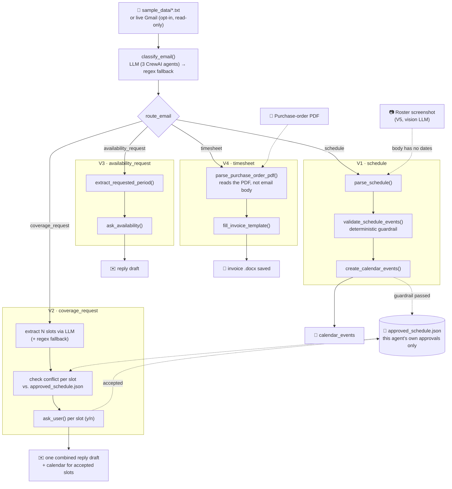

# Scheduler Agents


CrewAI-based portfolio project for automating interpreter schedule workflows.

## Architecture

A shared spine (receive email -> classify -> route) fans out into four
independent workflows. Every workflow ends in a draft or a locally-saved
file, never an automatic send, and every LLM extraction is checked by a
deterministic guardrail before anything reaches a calendar.



## Milestones

V1 focuses on the safest useful path:

```text
sample email -> classify email -> parse schedule -> validate events -> calendar-ready events
```

`classify_email` had a real false-positive: a vendor email complaining about a
late login for a *past* shift, and a separate one about a Criminal
Background Check renewal *deadline*, both mention a date/time and were
misclassified as `schedule` -- the CBC one especially, since neither
"schedule" nor "roster" even appears in it, so the offline regex fallback
correctly said `other`, but the live LLM crew got it wrong and, worse,
extracted the complaint's referenced shift time as if it were a new
calendar event. Fixed by adding explicit negative examples to the
`classify_email` task prompt (`crews/schedule_crew/config/tasks.yaml`):
a date/time appearing in the body isn't itself evidence of "schedule" --
attendance feedback about a shift that already happened, and compliance/
document-deadline reminders, are `other`. Re-verified live against both
real emails afterward: both now classify as `other` with zero events
extracted.

V2 adds the coverage-request workflow. A real coverage email can offer
*several* distinct slots at once -- specific dates, combined date/time
listings ("April 9: 10am-12pm and 1-2pm" is two slots), and sometimes a
vague, non-dated appeal alongside them ("we need help Mon-Wed 11am-1pm this
month"). Extraction tries an LLM first (handles 12-hour times, multiple
dates, split listings, relative phrases like "today" or "next Monday", and
keeps the vague appeal as a separate `coverage_unstructured_note` rather than
inventing dates for it), falling back to a single-slot regex parser if no LLM
is configured or it fails. Relative phrases are resolved against
`EmailInput.sent_date` (parsed from a `Date:` header when the source has one,
otherwise today) via a deterministic lookup table built in Python and handed
to the LLM -- the model looks the date up instead of computing it, which
keeps off-by-one weekday/week errors out of the one place plain code can
just get right.

Some real vendor emails list bare weekday names instead of dates entirely
(e.g. "Monday: 11am-3pm" under a "first week of March" heading). Asking the
LLM to turn that directly into a date is unreliable -- tested against a real
example, it assigned March 1-7 in list order without checking that March 1
actually falls on a Sunday, shifting every weekday's hours onto the wrong
date. So the model is only asked to extract `{weekday, start_time,
end_time}` pairs plus the period phrase verbatim; `resolve_period_phrase()`
resolves the phrase to a concrete week in Python (`calendar`-module date
arithmetic, no LLM involved), and each weekday is then placed within that
week directly. A period phrase that doesn't parse (or is missing) leaves
those slots out of the calendar entirely and surfaces a count in
`coverage_unstructured_note` instead of guessing. Tested against another
real vendor email mixing weekday-name-plus-day-of-month slots ("today
Thursday, 5th", "Friday, 6th", "Saturday, 7th" -- correctly resolved) with
genuinely unbounded recurring ones ("Saturdays: 2-4pm", no period at all --
correctly left out and flagged, not guessed).

Each extracted slot is checked against the local approved-schedule store for
conflicts (context only, see "Approved Schedule Store" below) and then the
human is asked directly -- "Can you cover this shift? (y/n)" -- one slot at a
time. The CLI prompt states the conflict result explicitly either way
("Conflict: yes/no"), not just as a warning when there happens to be one, so
silence is never ambiguous with "conflict wasn't even checked"; the check
itself never decides for them. Accepting a slot commits it
immediately (not just for future emails): if the same request offers two
overlapping slots, accepting the first makes the second show up as a
conflict too. One combined reply is drafted covering every slot; accepted
slots are added to `calendar_events` and the approved-schedule store. The
reply is always a draft -- nothing is ever sent automatically.

```text
coverage email -> extract N slots (+ optional vague note) -> check each conflict -> ask human per slot (y/n) -> one combined draft + calendar updates for accepted slots
```

This step is deliberately a plain terminal prompt rather than a notification
service (Telegram, email, etc.): a real async notification/response loop is
a legitimate future upgrade, but it's a separate infrastructure concern from
"the agent asks before deciding," and adding it now would be solving a
problem this project doesn't have yet.

V3 adds the availability-request workflow: the scheduler asks for the
interpreter's availability for a period (e.g. "your June availability"),
so unlike V1/V2 there's nothing to extract a decision from -- the flow
figures out which period is being asked about, asks the human to state
their availability for it, and drafts the reply. Same rules as V2: always a
draft, human approves and sends it.

```text
availability email -> extract period -> ask human for availability -> draft reply (never sent)
```

V4 adds the timesheet/invoice workflow. Here the vendor's monthly
notification email body carries no usable data at all ("please find
attached the Purchase Order...") -- job id, period, and amount all live in
the attached PDF, so this is the one workflow that reads a PDF directly
instead of `email.body`. It fills only the known monthly-varying cells in a
fixed Word invoice template (invoice number, date, job id, amount/total) and
saves a new `.docx` locally -- it never uploads or submits anything to the
vendor platform; the human reviews and submits it themselves. Every static
field (name, address, bank details, bill-to) is left untouched.

```text
purchase-order PDF -> extract job id/period/amount -> fill invoice template -> save .docx (never submitted)
```

V5 adds roster-screenshot extraction for V1. Real monthly rosters from this
vendor arrive as a *screenshot* of a spreadsheet -- a grid of dates x hourly
slots -- with zero parseable text in the email body, and no text layer for
regex or the text-only CrewAI agents to read. `parse_schedule` tries, in
order: LLM (already done in `classify_email` if it found anything) -> regex
over `email.body` -> a vision-capable LLM call over the roster image. This is
a plain API call (Groq's `qwen/qwen3.6-27b`), not a CrewAI agent, since it's
one single-shot "describe this image as JSON" call rather than multi-step
reasoning. It also reads the roster's own timezone label (e.g. "UK") from the
column headers, since that can differ from the interpreter's own default
timezone. As with every other LLM path in this project, the deterministic
guardrail (`validate_schedule_events`) always re-runs over whatever it
extracts. Real rosters have no language column at all -- this vendor
relationship is Persian interpretation only, a known fact about the
interpreter's employment, not per-email data -- so `validate_schedule` (V1)
and `handle_coverage_request` (V2) assign `UserMemory.default_language` to
every event/slot unconditionally rather than treating it as something to
extract or validate; `validate_schedule_events` has no language check at
all as a result.

```text
roster screenshot -> vision LLM -> events + timezone label -> deterministic guardrail -> calendar (or blocked + approval)
```

The project is intentionally designed with:

- CrewAI Flow orchestration
- Role-based agents
- Deterministic tools
- Pydantic state models
- Guardrails and validation
- Async execution path
- Hook-style event logging
- Simple local memory
- Human approval points for risky actions

## Project Structure

```text
scheduler-agents/
├── pyproject.toml
├── .env.example
├── README.md
├── sample_data/
│   ├── sample_schedule_email.txt
│   ├── sample_coverage_request_email.txt
│   ├── sample_coverage_request_relative_dates_email.txt
│   ├── sample_coverage_request_weekly_availability_email.txt
│   ├── sample_coverage_request_mixed_dates_email.txt
│   ├── sample_availability_request_email.txt
│   ├── sample_purchase_order_email.txt
│   ├── sample_purchase_order.pdf
│   ├── sample_roster_email.txt
│   ├── sample_roster.png
│   ├── sample_approved_schedule.json
│   ├── sample_other_attendance_complaint_email.txt
│   ├── sample_other_compliance_deadline_email.txt
│   └── invoice_template.docx
├── src/
│   └── scheduler_agents/
│       ├── main.py
│       ├── crews/
│       │   └── schedule_crew/
│       │       ├── crew.py
│       │       ├── config/
│       │       │   ├── agents.yaml
│       │       │   └── tasks.yaml
│       │       └── guardrails/
│       │           └── guardrails.py
│       ├── flows/
│       │   └── scheduler_flow.py
│       ├── guardrails/
│       │   └── schedule_guardrails.py
│       ├── hooks/
│       │   └── event_hooks.py
│       ├── memory/
│       │   └── user_memory.py
│       ├── models/
│       │   └── state.py
│       └── tools/
│           ├── availability_tool.py
│           ├── calendar_tool.py
│           ├── coverage_tool.py
│           ├── gmail_tool.py
│           ├── invoice_tool.py
│           ├── llm_json.py
│           ├── roster_vision_tool.py
│           ├── schedule_parser_tool.py
│           ├── schedule_store.py
│           └── timesheet_tool.py
└── tests/
    ├── conftest.py
    ├── test_scheduler_flow_units.py
    ├── test_coverage_workflow.py
    ├── test_availability_workflow.py
    ├── test_timesheet_workflow.py
    ├── test_roster_vision_workflow.py
    ├── test_gmail_workflow.py
    ├── test_schedule_store.py
    └── test_llm_json.py
```

## Two run modes

The flow works with **zero setup and zero cost**: if no `MODEL`/API key is
configured, `classify_email` and `parse_schedule` fall back to a deterministic
regex path, so tests, CI, and demos never need an API key.

Set `MODEL` and a matching API key in `.env` to switch on the real CrewAI
agents (`inbox_intelligence_agent`, `schedule_parser_agent`,
`schedule_validator_agent` from `crews/schedule_crew/`) for classification and
extraction. See `.env.example` for free options (Google Gemini, Groq) and
paid ones (OpenAI). If the LLM call fails for any reason (bad key, rate
limit, network), the flow logs it as a hook event and falls back to the
regex path rather than crashing.

Either way, the final schedule-validation guardrail is always the
deterministic one (`guardrails/schedule_guardrails.py`) — the LLM is trusted
to extract data, never to decide on its own that data is safe to write to a
calendar.

Not every LLM call in this project goes through the 3-agent CrewAI crew:
that crew is specifically for schedule classification/extraction, where
multi-step agent handoffs (classify -> extract -> validate) are the point.
Coverage-slot extraction (V2) and roster-image extraction (V5) are each one
single-shot "read this as JSON" call -- via `litellm.completion()` for
coverage (so it follows whatever `MODEL` is configured, same as the crew)
and a direct Groq vision call for the roster image (Groq is currently the
only configured provider with vision support here). A CrewAI Task/Crew
would add ceremony without adding anything for either of those.

This project is pinned to Python 3.12 via `.python-version` (crewai's
dependency chain lags behind the newest CPython releases).

## Approved Schedule Store

V2's conflict check deliberately does *not* talk to a real calendar.
[`schedule_store.py`](src/scheduler_agents/tools/schedule_store.py) reads
and writes a local `outputs/approved_schedule.json` -- a flat list of
`ScheduleEvent`s -- which is this agent's *only* source of truth for "is
this coverage slot already committed":

- V1 (`create_calendar_events`) appends a month's schedule to it once that
  schedule clears the deterministic guardrail -- the same "approved" bar V1
  already applies before building calendar payloads at all.
- V2 (`handle_coverage_request`) reads it for the conflict check, and
  appends any slot the human accepts, immediately -- so a second overlapping
  slot offered in the *same* email is flagged against the one just
  accepted, not just against future emails.
- Re-saving an identical date/start/end (e.g. re-running the same month) is
  deduped rather than appended twice.

A real personal calendar (Google/Outlook) mixes in dentist appointments,
school pickups, and everything else that has nothing to do with work
scheduling -- pointing V2's conflict check at one would flag all of that as
"conflicts" a work-coverage agent has no reason to know about, and would
require OAuth/credentials/scopes for a signal that's actually less accurate
than what this agent already knows about itself. The approved schedule this
agent built and got a human to sign off on **is** the correct source of
truth for this specific question.

The store is a flat JSON file for now (`json.dumps`/`json.loads`,
`sample_data/sample_approved_schedule.json` auto-seeds it on first run) --
plenty for this project's scale. If this ever needs concurrent writers or
queries across many months, that's a SQLite migration (`approved_schedules`
+ `schedule_slots` tables), not a redesign -- `schedule_store.py` is the one
place that would change.

## Live Gmail Ingestion (optional)

Same zero-setup default as everything else: `GMAIL_ENABLED` unset/false (the
default) means `receive_email` reads `sample_data/*.txt` -- no Google
account needed for tests, CI, or a demo run.

Set `GMAIL_ENABLED=true` plus a Google OAuth `credentials.json` (see
`.env.example` for the exact setup steps) to switch on
[`gmail_tool.py`](src/scheduler_agents/tools/gmail_tool.py): each run
fetches the single most recent message matching `GMAIL_QUERY` via
`messages().list()`/`.get()`, decodes its MIME body (walks multipart
messages for the first `text/plain` part), and uses its real `Date` header
as `EmailInput.sent_date` -- the same field V2's relative-date resolution
already anchors to, so "today"/"next Monday" in a real inbox message
resolve correctly without any extra wiring.

`GMAIL_QUERY` defaults to `from:glocco.com is:unread` even with the env var
unset -- this project automates one real vendor relationship, not a generic
inbox scanner, so scoping to it is the built-in behavior, not something
that needs configuring. Override the env var only if you need something
narrower/different.

The OAuth scope is deliberately the narrowest one that exists for this --
`gmail.readonly`. This integration calls `list`/`get` only: it never marks a
message read, labels it, archives it, sends anything, or deletes anything.
A human decides what happens to the source email in their own inbox; this
agent only ever reads it. The one-time consent runs in your own browser on
first live run and caches a refresh token to `token.json` (gitignored) so
it doesn't prompt again. A live fetch failure (expired token, network, or
simply nothing matching the query) is logged as a hook event and falls back
to the sample-file path rather than crashing, same as every other external
call in this project.

## Run

```bash
uv sync
uv run python -m scheduler_agents.main
```

Run the coverage-request path instead:

```bash
uv run python -m scheduler_agents.main --sample sample_coverage_request_email.txt
```

Run the availability-request path (it will prompt you in the terminal for
your availability):

```bash
uv run python -m scheduler_agents.main --sample sample_availability_request_email.txt
```

Run the timesheet/invoice path (fills `sample_data/invoice_template.docx`
from `sample_data/sample_purchase_order.pdf` and saves the result to
`outputs/`):

```bash
uv run python -m scheduler_agents.main --sample sample_purchase_order_email.txt
```

Run the schedule path against a roster screenshot instead of the plain-text
sample (falls back to vision extraction since the email body has no
parseable dates; requires `GROQ_API_KEY`):

```bash
uv run python -m scheduler_agents.main --sample sample_roster_email.txt --roster-image sample_data/sample_roster.png
```

For a quick run without installing the package first:

```powershell
$env:PYTHONPATH="src"
python -m scheduler_agents.main
```

The run writes:

```text
outputs/calendar_payloads.json
outputs/flow_state.json
```

## Test

```bash
uv run pytest
```

`uv run` auto-loads `.env`, so without `tests/conftest.py` a configured
MODEL/API key would silently leak into the test run. `conftest.py` strips
those env vars for every test, so the suite always exercises the
deterministic path — fast, offline, free, and not dependent on a third-party
API being up.

## Next Steps

1. ~~Replace the sample email input with real ingestion~~ -- done for
   Gmail (see "Live Gmail Ingestion" above); Outlook would need its own
   tool module following the same `is_live_*_enabled()` / fallback pattern
   as `gmail_tool.py` and `schedule_store.py`.
2. ~~Connect V2's conflict check to a real calendar~~ -- deliberately not
   done, and not planned: see "Approved Schedule Store" above for why a
   local store of this agent's own approvals is a better source of truth
   than a real Google/Outlook calendar for this specific question, and
   removes the OAuth/credentials surface entirely.
3. Move the coverage-request y/n prompt off the terminal onto an actual
   notification channel (e.g. Telegram) so it doesn't require the flow to be
   running interactively -- this needs an async "ask now, resume later"
   design (persisted pending-decision state, polling/webhook for the
   response), not just swapping `input()` for an API call.
4. ~~Coverage-slot extraction still can't resolve *relative* dates~~ --
   done: relative phrases ("today", "tomorrow", "next Monday") now resolve
   via a deterministic lookup table anchored to `EmailInput.sent_date` (a
   parsed `Date:` header, falling back to today). Try it with:

   ```bash
   uv run python -m scheduler_agents.main --sample sample_coverage_request_relative_dates_email.txt
   ```

   (requires `MODEL`/an API key -- the regex fallback still only handles the
   strict explicit-date format, by design.)
5. Add CrewAI eval cases for classification, parsing, and safe tool use.
6. Split classification from extraction so the extractor/validator agents
   only run once an email is already known to be a schedule email, instead
   of always running the full three-task crew.
7. Read the vendor's real PDF attachment straight from Gmail/Outlook instead
   of a local `timesheet_pdf_path`, once real email ingestion (item 1) lands.
8. Extend PDF extraction with an LLM fallback for purchase orders that don't
   match this template's exact layout (job id format, "Total" line wording),
   the same way schedule extraction already has an LLM path alongside regex.
9. Roster vision extraction only supports Groq (`qwen/qwen3.6-27b`) today and
   has no LLM-provider fallback if that key/model isn't configured -- unlike
   every other extraction path in this project.
10. ~~Roster/coverage extraction has no per-slot language~~ -- done, then
    simplified further: language isn't extracted or validated per event at
    all anymore. `UserMemory.default_language` (default `"Persian"`) is
    assigned unconditionally in `validate_schedule` (V1) and
    `handle_coverage_request` (V2) -- the two choke points every extraction
    path passes through -- because this project automates one real vendor
    relationship where the language is a fixed fact, not per-email data.
    `validate_schedule_events` no longer has a language check at all.
    Verified live against a real roster email that previously tripped
    "Missing language" on every one of 5 rows -- now 0 validation errors,
    5/5 calendar payloads created, each correctly showing "Language: Persian".

## Course-Style CrewAI Pieces

The project includes the same course-style separation used in the assignment:

- `crews/schedule_crew/config/agents.yaml` for agent role, goal, and backstory.
- `crews/schedule_crew/config/tasks.yaml` for task descriptions, expected outputs, context, and async execution.
- `crews/schedule_crew/crew.py` for `@CrewBase`, `@agent`, `@task`, and `@crew` decorators.
- `crews/schedule_crew/guardrails/guardrails.py` for task output validation.

## License

[MIT](LICENSE) — see the LICENSE file for the full text.
